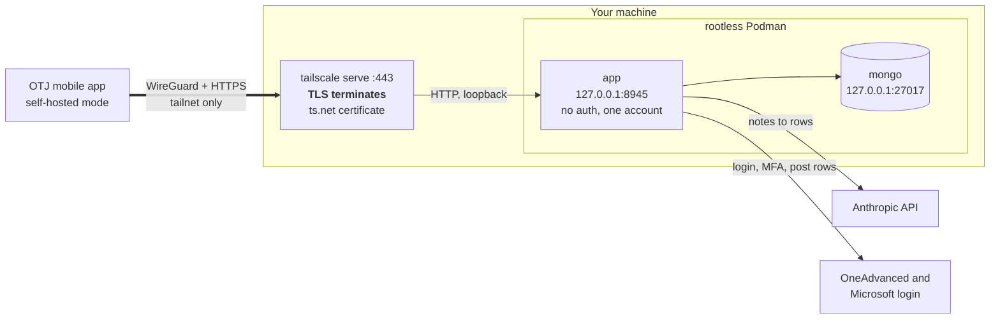

# otjServices (self-hosted)

The backend for a mobile app that logs OTJ (off-the-job) training hours on OneAdvanced's
education platform. You write free-text notes, an LLM turns them into activity-log entries, and
the service logs into OneAdvanced on your behalf, holding the session open through MFA, and posts
the entries.

This is the `tailscale` branch: a single-user copy you run yourself, on your own machine, reachable
only from your tailnet. The hosted, multi-user service lives on `master`.

- **Running it:** [`deploy/README.md`](deploy/README.md). Install Nix and Tailscale, fill in
  `.env`, then `./bootstrap.sh --prod`.
- **Working on it:** [`AGENTS.md`](AGENTS.md).

