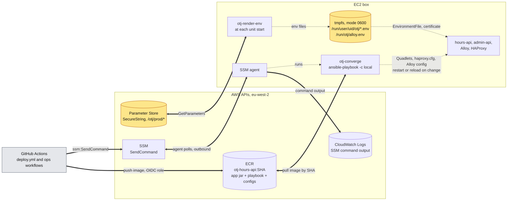

# otjServices

The backend for a mobile app that logs OTJ (off-the-job) training hours on OneAdvanced's
education platform. The user writes free-text notes, an LLM turns them into activity-log entries,
and the service logs into OneAdvanced on their behalf, holding the session open through MFA, and
posts the entries. Everything a contributor needs to know is in [`AGENTS.md`](AGENTS.md).

## Architecture

The production box on AWS: HAProxy at the edge behind Cloudflare, the two apps on loopback in
rootless Podman, the admin API reachable only over the tailnet, secrets from Parameter Store, and
every change applied by Ansible. Grafana Alloy and Grafana Cloud are not live yet; they arrive with
step 7 of [`ansible-deploy-checklist.md`](ansible-deploy-checklist.md). The reasoning, and a table
of every hop and where its TLS ends, are in [`ansible-migration-plan.md`](ansible-migration-plan.md)
§4. There are two diagrams, because all of it in one Mermaid chart doesn't lay out legibly.

**Traffic and logs**

```mermaid
flowchart LR
  learner["Learner<br/>Expo mobile app"]
  you["You, the operator<br/>laptop or phone on the tailnet"]

  subgraph cloudflare["Cloudflare"]
    cfedge["Cloudflare edge<br/>otj-services.com, proxied<br/>WAF and DDoS protection<br/><b>TLS terminates</b><br/>Cloudflare edge certificate"]
  end

  subgraph aws["AWS eu-west-2"]
    sg{{"Security group<br/>inbound TCP 443 from Cloudflare ranges only<br/>nothing else, no SSH"}}
    subgraph box["EC2 t3.small, Ubuntu 24.04, Elastic IP"]
      haproxy["HAProxy 2.8<br/>0.0.0.0:443 and [::]:443<br/><b>TLS terminates</b><br/>Cloudflare Origin CA certificate<br/>client IP from CF-Connecting-IP<br/>per-IP rate limits, 1 MB body cap"]
      tsserve["tailscaled + tailscale serve<br/>tailnet address only<br/>:8443 to admin-api, :8444 to hours-api<br/><b>TLS terminates</b><br/>Let's Encrypt cert for the ts.net name<br/>injects Tailscale-User-Login"]
      subgraph podman["rootless Podman"]
        api["hours-api<br/>Jersey on Grizzly, HTTP<br/>published on 127.0.0.1:8945 only"]
        admin["admin-api<br/>HTTP, published on 127.0.0.1:8946 only<br/>AdminIdentityFilter + allowlist"]
      end
      journald[("journald<br/>persistent, 500 MB cap<br/>full local copy")]
      alloy["Grafana Alloy<br/>rootful Quadlet, read-only mounts<br/>UI on 127.0.0.1:12345<br/>truncates client IPs"]
    end
  end

  subgraph thirdparty["Third-party services"]
    grafana["Grafana Cloud, free tier<br/>Loki + Grafana, EU or UK region<br/>you are the only member"]
    atlas[("MongoDB Atlas<br/>allowlist: the Elastic IP")]
    anthropic["Anthropic API"]
    oneadv["OneAdvanced and<br/>Microsoft login"]
  end

  %% Public request path
  learner ==>|"HTTPS over TLS<br/>TCP 443"| cfedge
  cfedge ==>|"HTTPS, a new TLS session<br/>TCP 443 to the Elastic IP<br/>SSL mode Full (strict)"| sg
  sg ==> haproxy
  haproxy -->|"HTTP/1.1, plaintext<br/>loopback 127.0.0.1:8945"| api

  %% Tailnet path
  you ==>|"WireGuard, UDP 41641<br/>or DERP relay on TCP 443<br/>carrying HTTPS to :8443 and :8444<br/>tailscaled dials out, no inbound rule"| tsserve
  tsserve -->|"HTTP, loopback :8946<br/>+ Tailscale-User-Login"| admin
  tsserve -->|"HTTP, loopback :8945"| api

  %% Logs
  haproxy -.->|"access log to stdout"| journald
  api -.->|"stdout, Podman journald driver"| journald
  admin -.->|"stdout, Podman journald driver"| journald
  journald -.->|"read-only mount"| alloy
  alloy ==>|"HTTPS over TLS, TCP 443<br/>Loki push API<br/>write-only token"| grafana
  you ==>|"HTTPS over TLS, TCP 443<br/>SSO + 2FA"| grafana

  %% Outbound dependencies, all leaving from the Elastic IP
  api ==>|"MongoDB protocol over TLS<br/>TCP 27017"| atlas
  admin ==>|"MongoDB protocol over TLS<br/>TCP 27017"| atlas
  api ==>|"HTTPS over TLS, TCP 443"| anthropic
  api ==>|"HTTPS over TLS, TCP 443"| oneadv

  classDef tls fill:#fde68a,stroke:#b45309,color:#111
  classDef loopback fill:#dbeafe,stroke:#1d4ed8,color:#111
  classDef ext fill:#e5e7eb,stroke:#4b5563,color:#111
  classDef gate fill:#fecaca,stroke:#b91c1c,color:#111
  class cfedge,haproxy,tsserve tls
  class api,admin,alloy,journald loopback
  class grafana,atlas,anthropic,oneadv,learner,you ext
  class sg gate
```

**Deploys and secrets**

| In the diagrams | Means |
|---|---|
| Thick line | Encrypted on the wire (TLS, or WireGuard). In the second diagram, every thick line is HTTPS on TCP 443. |
| Two-headed thick line | The box opens the connection and the data comes back to it. Nothing in the second diagram connects **in** to the box: SSM, ECR and Parameter Store are all reached outbound. |
| Thin line | Plaintext HTTP, which never leaves loopback |
| Dotted line | Not network traffic: stdout, file reads and writes, or one process starting another |
| Amber box | TLS terminates here (first diagram); holds or serves secrets (second diagram) |
| Blue box | Listens on, or reads from, the box only |
| Red hexagon | The only inbound filter AWS applies |
