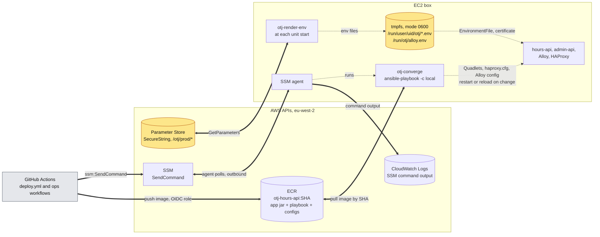

# Box configuration as code (Ansible) — plan

**Status:** agreed · 2026-09-24, D1–D5 decided 2026-09-25 · **revised 2026-09-25 to build a new
box rather than adopt the old one** (below) · the working checklist is `ansible-deploy-checklist.md`

**Goal:** nobody opens an SSM session on the EC2 box to change it again. Everything the box has
(packages, users, the edge proxy, Tailscale, Quadlets, how secrets reach the app, log shipping)
is declared in this repo, checked on every PR, and applied by CI on every merge to `master`. The
box stays the deployment target. Nothing moves to Fargate, and the monthly cost stays about the
same (§12). Nobody needs a shell to *read* the box either: the edge proxy's, the API's and the
admin API's logs are all in one Grafana Cloud dashboard (§4.5).

**Scope:** the **inside** of the box. AWS resources stay in CDK. Cloudflare, Tailscale and Grafana
Cloud account settings stay manual for now (§13 lists them as follow-ups). Metrics are not part of
this plan, but the log shipper is chosen so that adding them later needs no new agent (§13).

> **2026-09-25: the box was lost, and this plan now builds its replacement.** The merge of #44
> replaced the EC2 instance. The stack resolved Canonical's `stable/current` Ubuntu AMI on every
> deploy, Canonical had published a new one, and a new `ImageId` forces a replacement.
> CloudFormation moved the Elastic IP to a blank instance and terminated the hand-provisioned box,
> root volume and all, with no snapshot. User data (Atlas), images (ECR) and the Elastic IP
> survived. The env files, the Origin CA key and the Tailscale node did not.
>
> The public API stays down, **by choice**, until this plan has built the new box. There's no
> round of hand provisioning first. #45 pins the AMI and adds a stack policy that refuses to
> replace the instance or the EIP (`aws/README.md`).
>
> This removes all of the plan's "adopt a live box without disturbing it" machinery: no
> inventory, no Caddy-verify-only mode, no env-file stage before Parameter Store, and no proxy
> cutover. The first apply builds the end state directly (§10).

> Sections are numbered so review comments can point at them. Decisions are **D1–D5** in §1.
> Claims not yet checked against a real run are marked *(verify)*.

---

## Contents

1. [Decisions needed](#1-decisions-needed)
2. [Ansible in five minutes, for this repo](#2-ansible-in-five-minutes-for-this-repo)
3. [What the old box had](#3-what-the-old-box-had)
4. [Design](#4-design)
5. [Repository layout](#5-repository-layout)
6. [Roles](#6-roles)
7. [Secrets](#7-secrets)
8. [CI: checks on every PR](#8-ci-checks-on-every-pr)
9. [CD: deploy on merge, and ops without a shell](#9-cd-deploy-on-merge-and-ops-without-a-shell)
10. [Building the new box](#10-building-the-new-box)
11. [Rebuilding it again](#11-rebuilding-it-again)
12. [Cost](#12-cost)
13. [Out of scope, and follow-ups](#13-out-of-scope-and-follow-ups)
14. [Risks](#14-risks)
15. [What gets deleted, and docs to update](#15-what-gets-deleted-and-docs-to-update)

---

## 1. Decisions needed

### D1 — Where Ansible runs

| Option | How | For | Against |
|---|---|---|---|
| **A. On the box, against itself** (`ansible-playbook -c local`), started by CI through `ssm:SendCommand` | The playbook ships inside the app image, and a small bootstrap script on the box extracts it and runs it | No new AWS permissions (CI already has `SendCommand`). No S3 bucket. The config version always matches the image version. | `ansible-core` has to be installed on the box |
| B. On the GitHub runner, connecting through the `community.aws.aws_ssm` connection plugin | Ansible drives the box remotely over SSM | The textbook controller/target split | The plugin needs an S3 bucket to transfer files, extra IAM, and is slow (one SSM round trip per task) |

**Decided: A** (2026-09-25).

### D2 — Where secrets live

| Option | Cost | Notes |
|---|---|---|
| **A. SSM Parameter Store `SecureString`** (standard tier, AWS-managed `aws/ssm` key) | **$0** | Encrypted, access controlled by IAM, audited by CloudTrail. No automatic rotation, which nothing here would use anyway. |
| B. Secrets Manager | $0.40 per secret per month | Adds automatic rotation and cross-account sharing, and neither is needed. |

**Decided: A** (2026-09-25). Both are read with the instance role, and both are pulled when a
unit starts, never written by Ansible (§7).

### D3 — The public reverse proxy

The old box ran Caddy from the Cloudsmith apt repo, with `caddy add-package` swapping in a binary
that has the third-party `caddy-ratelimit` plugin, then `apt-mark hold`. `deploy/prod/README.md`
spent two pages on how that goes wrong. Keeping Caddy would have meant either building it in CI with
`xcaddy` or keeping `add-package`.

| Option | Verdict |
|---|---|
| **A. HAProxy 2.8 from Ubuntu 24.04 `main`** | Everything the Caddyfile does is built in (the mapping is in §6). No plugin, no build step, no third-party repo. Ubuntu ships its security fixes. CI validates the config with the same package. |
| B. Caddy built in CI with `xcaddy` | Rejected: adds a build artifact to CI and ~45 MB to the image |
| C. Caddy apt + `add-package` (the old box) | Rejected: `add-package` downloads from Caddy's build service at run time, so it isn't reproducible and fails if that service is down |
| D. nginx (apt) | Rejected: `limit_req` rates are per second or per minute only, so the 250/day cap can't be expressed |
| E. Envoy | Rejected: per-client-IP limits need Envoy's separate rate-limit service plus Redis, and the config is far longer |

**Decided: A** (2026-09-25). With no live box to adopt, HAProxy goes in on the first apply, and
Caddy never comes back.

### D4 — Cloudflare Tunnel now or later

A Tunnel would remove the Origin CA certificate, the Cloudflare IP list in the security group,
and the port 443 clash with `tailscale serve`. With Ansible in place, it is one new role plus a
DNS change.

**Decided: later** (2026-09-25), as a separate plan (§13). The first apply already builds a whole
box at once. Keeping the network path as it was means a problem in the first few days is either
the playbook's or the box's, and never "or the tunnel's".

### D5 — Where the logs go

Three log trails matter: the edge proxy (HAProxy), `hours-api` and `admin-api`. On the old box
they were only readable from an SSM session.

| Option | Cost | For | Against |
|---|---|---|---|
| **A. Grafana Cloud free tier (hosted Loki), shipped by Grafana Alloy on the box** | **$0** | Nothing extra runs on the box but Alloy. One dashboard for all three trails. The same agent and stack take metrics later (§13). | Logs leave the box for a third party (§4.5 covers what is sent). Retention is about 14 days *(verify current free-tier limits)*. Access is a Grafana Cloud login, not the tailnet. |
| B. CloudWatch Logs through Fluent Bit, with a Grafana on the tailnet | ~$0.60/GB ingested, so cents at this volume | Logs stay in the AWS account and outlive the box | Grafana still has to run somewhere. Metrics later mean CloudWatch custom metrics at about $0.30 per series per month, or a second stack. |
| C. Loki and Grafana on the box, over `tailscale serve --https=8445` | $0 in services | Nothing leaves the box. Access through the tailnet, like the admin API. | Two JVMs already share 2 GB, so this probably needs a t3.medium (about +$17/month, and a stop/start of production). Logs are lost with the box. |

**Decided: A** (2026-09-25), **on one condition: you are the only person who can read it.**
Since the dashboard isn't behind the tailnet, the Grafana Cloud account is the only access
control. The rules that keep it single-user are in §4.5, and step 7 of §10 checks them before the
first line is sent.

---

## 2. Ansible in five minutes, for this repo

Only the parts this plan uses.

| Concept | What it is | Here |
|---|---|---|
| **Playbook** | A YAML file listing which roles to apply to which hosts | `deploy/ansible/site.yml`: one play, `hosts: localhost` |
| **Role** | A folder of related tasks, templates and handlers | `base`, `tailscale`, `edge`, `app`, … (§6) |
| **Task** | One desired state, e.g. "this package is installed" or "this file has this content" | `ansible.builtin.apt`, `copy`, `template`, `systemd_service`, `uri` |
| **Idempotence** | Running a task twice changes nothing the second time. Tasks describe *state*, not *steps*. | Every CI run applies the playbook **twice** and fails if the second run changed anything (§8) |
| **Handler** | A task that runs only when something **changed**, e.g. "reload HAProxy if `haproxy.cfg` changed" | Restarts happen only when that unit's config or image actually changed |
| **Check mode** (`--check --diff`) | A dry run that prints what *would* change, with file diffs | How the first apply is reviewed before it runs (§10), and the nightly drift check (§9.3) |
| **Variables** | Values in `group_vars/`, overridable with `-e` | `image_tag`, ports, the Tailscale hostname. **Never secrets** (§7). |
| **`become`** | Run a task as a different user | Root by default; `become_user: otjapp` for the rootless Podman parts |
| **`no_log: true`** | Hides a task's arguments and results from output | On any task that could touch a secret. SSM output ends up in GitHub Actions logs. |
| **Tags** | Labels for running or skipping groups of tasks | `tailnet` and `aws` are skipped in the CI rehearsal (§8.3) |

The commands you'll actually use:

```bash
ansible-playbook -i inventory.ini site.yml --syntax-check
ansible-playbook -i inventory.ini site.yml --check --diff -e image_tag=<sha>   # dry run
ansible-playbook -i inventory.ini site.yml -e image_tag=<sha>                  # apply
ansible-lint                                                                    # style + common mistakes
```

In normal use you won't run these by hand at all. CI runs them on the box for you (§9).

---

## 3. What the old box had

The destroyed box was provisioned by hand through SSM sessions, following `deployment-checklist.md`
§6 and `deploy/prod/README.md`. This table is the list of what the new box needs, and every row is
now code. The right-hand column is the lesson learned the hard way that each row's task has to
encode. The runbook's warnings become comments next to the task that prevents the problem.

| Old box, by hand | New box | Gotcha the task must encode |
|---|---|---|
| Install Tailscale, `tailscale up --hostname=hours-api` | `tailscale` role, auth key from Parameter Store (§7) | Only run `up` when `BackendState != Running`, so re-runs never re-authenticate the node. Remove the old, offline `hours-api` node first, or the new one becomes `hours-api-1`. |
| `tailscale set --operator=…` | Dropped | Ansible runs `serve` as root, so no operator is needed |
| `tailscale serve` 8444 → 8945, 8443 → 8946; **443 turned off** | `tailscale` role | **Never serve on 443.** HAProxy binds it. Role order in `site.yml` puts `tailscale` first, and `verify` asserts nothing but HAProxy holds `:443`. |
| Install Podman | `base` role | — |
| AWS CLI v2 from the zip | `base` role | Ubuntu's apt copy is v1 and too old for `ecr get-login-password` |
| `useradd otjapp`, `enable-linger` | `otjapp` role | Linger must exist before any `systemctl --user` task, or they fail with no user bus |
| Paste `deploy.sh` and the two templates into `~/otj-deploy/` | `app` role, sourced from the image | Trailing whitespace from pasting (issue #40) can't happen, because files are copied byte for byte |
| Write `~/otj-hours-api.env` and `~/otj-admin-api.env` | `render-env` from Parameter Store (§7). No env file is ever written to disk. | Secrets never pass through Ansible |
| Cloudsmith repo, `apt install caddy`, `add-package`, `apt-mark hold` | `edge` role: apt `haproxy` from Ubuntu `main` (D3) | No plugin, no hold, no third-party repo |
| Install the Origin CA pair, `640 root:caddy` | Still manual: a **newly issued** pair, installed once as `/etc/haproxy/certs/origin.pem` (§10 step 4). The `edge` role only checks it (§7). | Ansible never copies or reads the file, because `--diff` would print the key |
| Install the Caddyfile, validate **as `caddy`**, reload | `edge` role: `haproxy.cfg`, `haproxy -c` before every reload | The Caddy trap (validating as root created `access.log` as `root:root`, and the next reload died) doesn't carry over, because HAProxy logs to journald rather than to a file it owns (§4.5) |
| Hand-push files with `push-file.sh` | Deleted | — |
| Read logs with `journalctl` and `tail` in an SSM session | `observability` role (§4.5, D5) | The Alloy token can only **write** logs. A token with read access, sitting on the box, would be a second way into the dashboard. |

---

## 4. Design

### The end state

This is the box once §10 is finished: HAProxy at the edge, logs in Grafana Cloud, secrets
from Parameter Store. There are two diagrams, because all of it in one Mermaid chart doesn't lay out
legibly. The first shows traffic and logs, the second shows deploys and secrets.

**Traffic and logs**

```mermaid
flowchart LR
  learner["Learner<br/>Expo mobile app"]
  you["You, the operator<br/>laptop or phone on the tailnet"]

  subgraph cloudflare["Cloudflare"]
    cfedge["Cloudflare edge<br/>otj-services.com, proxied<br/>WAF and DDoS protection<br/><b>TLS terminates</b><br/>Cloudflare edge certificate"]
  end

  subgraph aws["AWS eu-west-2"]
    sg{{"Security group<br/>inbound TCP 443 from Cloudflare ranges only<br/>nothing else, no SSH"}}
    subgraph box["EC2 t3.small, Ubuntu 24.04, Elastic IP"]
      haproxy["HAProxy 2.8<br/>0.0.0.0:443 and [::]:443<br/><b>TLS terminates</b><br/>Cloudflare Origin CA certificate<br/>client IP from CF-Connecting-IP<br/>per-IP rate limits, 1 MB body cap"]
      tsserve["tailscaled + tailscale serve<br/>tailnet address only<br/>:8443 to admin-api, :8444 to hours-api<br/><b>TLS terminates</b><br/>Let's Encrypt cert for the ts.net name<br/>injects Tailscale-User-Login"]
      subgraph podman["rootless Podman"]
        api["hours-api<br/>Jersey on Grizzly, HTTP<br/>published on 127.0.0.1:8945 only"]
        admin["admin-api<br/>HTTP, published on 127.0.0.1:8946 only<br/>AdminIdentityFilter + allowlist"]
      end
      journald[("journald<br/>persistent, 500 MB cap<br/>full local copy")]
      alloy["Grafana Alloy<br/>rootful Quadlet, read-only mounts<br/>UI on 127.0.0.1:12345<br/>truncates client IPs"]
    end
  end

  subgraph thirdparty["Third-party services"]
    grafana["Grafana Cloud, free tier<br/>Loki + Grafana, EU or UK region<br/>you are the only member"]
    atlas[("MongoDB Atlas<br/>allowlist: the Elastic IP")]
    anthropic["Anthropic API"]
    oneadv["OneAdvanced and<br/>Microsoft login"]
  end

  %% Public request path
  learner ==>|"HTTPS over TLS<br/>TCP 443"| cfedge
  cfedge ==>|"HTTPS, a new TLS session<br/>TCP 443 to the Elastic IP<br/>SSL mode Full (strict)"| sg
  sg ==> haproxy
  haproxy -->|"HTTP/1.1, plaintext<br/>loopback 127.0.0.1:8945"| api

  %% Tailnet path
  you ==>|"WireGuard, UDP 41641<br/>or DERP relay on TCP 443<br/>carrying HTTPS to :8443 and :8444<br/>tailscaled dials out, no inbound rule"| tsserve
  tsserve -->|"HTTP, loopback :8946<br/>+ Tailscale-User-Login"| admin
  tsserve -->|"HTTP, loopback :8945"| api

  %% Logs
  haproxy -.->|"access log to stdout"| journald
  api -.->|"stdout, Podman journald driver"| journald
  admin -.->|"stdout, Podman journald driver"| journald
  journald -.->|"read-only mount"| alloy
  alloy ==>|"HTTPS over TLS, TCP 443<br/>Loki push API<br/>write-only token"| grafana
  you ==>|"HTTPS over TLS, TCP 443<br/>SSO + 2FA"| grafana

  %% Outbound dependencies, all leaving from the Elastic IP
  api ==>|"MongoDB protocol over TLS<br/>TCP 27017"| atlas
  admin ==>|"MongoDB protocol over TLS<br/>TCP 27017"| atlas
  api ==>|"HTTPS over TLS, TCP 443"| anthropic
  api ==>|"HTTPS over TLS, TCP 443"| oneadv

  classDef tls fill:#fde68a,stroke:#b45309,color:#111
  classDef loopback fill:#dbeafe,stroke:#1d4ed8,color:#111
  classDef ext fill:#e5e7eb,stroke:#4b5563,color:#111
  classDef gate fill:#fecaca,stroke:#b91c1c,color:#111
  class cfedge,haproxy,tsserve tls
  class api,admin,alloy,journald loopback
  class grafana,atlas,anthropic,oneadv,learner,you ext
  class sg gate
```



**Deploys and secrets**



| In the diagrams | Means |
|---|---|
| Thick line | Encrypted on the wire (TLS, or WireGuard). In the second diagram, every thick line is HTTPS on TCP 443. |
| Two-headed thick line | The box opens the connection and the data comes back to it. Nothing in the second diagram connects **in** to the box: SSM, ECR and Parameter Store are all reached outbound. |
| Thin line | Plaintext HTTP, which never leaves loopback |
| Dotted line | Not network traffic: stdout, file reads and writes, or one process starting another |
| Amber box | TLS terminates here (first diagram); holds or serves secrets (second diagram) |
| Blue box | Listens on, or reads from, the box only |
| Red hexagon | The only inbound filter AWS applies |

**Every hop, and where its TLS ends:**

| # | From → to | Protocol and port | Encryption | Terminated by | Certificate |
|---|---|---|---|---|---|
| 1 | Learner → Cloudflare | HTTPS, TCP 443 (UDP 443 if HTTP/3 is on for the zone) | TLS | Cloudflare edge | Cloudflare's edge certificate for `otj-services.com` |
| 2 | Cloudflare → HAProxy | HTTPS, TCP 443 to the Elastic IP, through the security group | TLS, a **separate** session from hop 1. Full (strict) makes Cloudflare validate the origin certificate. | HAProxy | Cloudflare Origin CA, 15 years, on disk at `/etc/haproxy/certs/origin.pem` (§7) |
| 3 | HAProxy → hours-api | HTTP/1.1, `127.0.0.1:8945`, through Podman's port forward | **None**, and that's safe only because it's loopback. AGENTS.md's loopback rule and §4.4's wildcard-listener check keep it that way. | — | — |
| 4 | You → `tailscale serve` | HTTPS to `:8443` (admin) or `:8444` (hours-api), inside WireGuard on UDP 41641, or DERP relays on TCP 443 when a direct path fails | WireGuard, with TLS inside it | `tailscaled` on the box | Let's Encrypt, for the box's `ts.net` name |
| 5 | `tailscale serve` → admin-api / hours-api | HTTP, `127.0.0.1:8946` / `:8945`, plus the `Tailscale-User-Login` header | **None**, loopback. This is why the header can be believed (AGENTS.md, "Two processes"). | — | — |
| 6 | Alloy → Grafana Cloud | HTTPS, TCP 443, Loki push API | TLS | Grafana Cloud | Public CA |
| 7 | You → Grafana Cloud | HTTPS, TCP 443 | TLS | Grafana Cloud | Public CA |
| 8 | hours-api, admin-api → MongoDB Atlas | MongoDB wire protocol, TCP 27017 | TLS (Atlas requires it) | Atlas | Public CA |
| 9 | hours-api → Anthropic, OneAdvanced, Microsoft | HTTPS, TCP 443 | TLS | Each provider | Public CA |
| 10 | Box, GitHub Actions → AWS APIs (SSM, Parameter Store, ECR, CloudWatch Logs) | HTTPS, TCP 443 | TLS | AWS | Amazon's CA |

Every connection in hops 6 to 10 is **outbound** from the box or from GitHub. The security group needs
no rule for any of them, or for the tailnet: `tailscaled` dials out first, and the return traffic is
allowed because the group is stateful. Hop 2 is the only inbound traffic AWS lets in.

*(Verify on the zone: the minimum TLS version and whether HTTP/3 is on for hop 1. Cloudflare's default
minimum is TLS 1.0, and 1.2 is the sensible floor for an API used only by a current mobile app.)*

### 4.1 Two layers, one artifact

```
image otj-hours-api:<sha>
  /app/app.jar
  /deploy/ansible/...          ← the playbook, roles, templates, group_vars
  /deploy/bin/otj-converge
  /deploy/haproxy/haproxy.cfg, cloudflare-ips.lst
```

Everything the box needs for a release is inside the image for that release, which is #40's
idea taken all the way. Rolling back to an old SHA brings back that SHA's Quadlets, proxy config
and playbook together. The HAProxy *binary* comes from apt, so a rollback doesn't downgrade it.

### 4.2 `otj-converge`, the one script on the box

A small bash script at `/usr/local/sbin/otj-converge`. It is installed once by hand (§10, step 4),
or by cloud-init on a rebuilt box, and **after that the playbook manages it**, so it updates
itself.

```
otj-converge <sha> [--check]
  1. ensure ansible-core and podman are installed (apt; noop after first run)
  2. ECR login + pull <repo>:<sha> as ROOT, into root's image storage
  3. extract /deploy from the image → /opt/otj/releases/<sha>/  (keeps the last 5),
     then remove the image from root's storage
  4. ansible-playbook -c local -i localhost, site.yml -e image_tag=<sha> [--check --diff]
  5. exit with ansible's status
```

Steps 2–3 run as root, not as `otjapp`, so the script works on a blank box, where `otjapp` doesn't
exist until the playbook creates it. The `app` role then pulls the same image into `otjapp`'s
rootless storage, where the containers run. That's a second pull per release, which is fine at
this size. The script needs the AWS CLI for the ECR login, so the §10 step 4 bootstrap installs
it, and `base` manages it from then on.

It is written as plain, top-to-bottom bash so it is easy to read in an emergency.
`--check` is how the nightly drift job and the pre-apply review (§10 step 5) run it.

### 4.3 Why restarts only happen when something changed

The image tag is templated into each Quadlet (`Image=…:<sha>`). A new SHA changes the Quadlet
file, which notifies the handler that restarts that unit. The same SHA converged twice changes
nothing, so nothing restarts. So "redeploy", "re-apply config" and "fix drift" are all the same
command, and each only touches what actually differs.

### 4.4 Health and safety checks at the end of every run

The `verify` role runs last on every apply:

- `GET 127.0.0.1:8945/health` and `:8946/health`, with retries (replaces `deploy.sh`'s loop).
- `haproxy.service` is active, and `haproxy -c` passes on the live config.
- The origin certificate has more than 90 days left (`openssl x509 -checkend`). It is a 15-year
  certificate, so this should only fire once, as a reminder, long before it matters.
- **No wildcard listeners except the expected ones.** `ss -Hltn` must show `0.0.0.0:443` and
  `[::]:443` (HAProxy) and nothing else on `0.0.0.0` or `[::]`. Ubuntu's AMI ships with `sshd` on
  `0.0.0.0:22`, and `base` masks it (§6), so the check makes no exception for `:22`. This is
  AGENTS.md's loopback rule for 8945 and 8946 turned into a check that fails the deploy.
- `tailscale serve status --json` shows exactly the 8443 and 8444 mappings and nothing on 443.
- Alloy answers `GET 127.0.0.1:12345/-/ready` (§4.5). The wildcard check above already covers its
  port, so if it ever listens on `0.0.0.0`, the deploy fails.

### 4.5 Logs: three trails, one dashboard (D5)

```
 box                                                         Grafana Cloud (one stack, one user)
  journald (persistent, 500 MB cap)
   ├─ haproxy.service ................ service="edge"   ─┐
   ├─ CONTAINER_NAME=hours-api ....... service="hours-api" ├─► Alloy ──HTTPS push──► Loki ──► Grafana
   └─ CONTAINER_NAME=admin-api ....... service="admin-api" ─┘   (write-only token)
```

**One source: journald.** Everything goes through the journal, so Alloy needs one reader and the
box keeps a full local copy that doesn't depend on Grafana Cloud.

| Trail | How it reaches the journal | Labels in Loki |
|---|---|---|
| Edge (HAProxy) | `log stdout format raw local0` in `haproxy.cfg`'s `global`. Under systemd, stdout **is** the journal, so there's no rsyslog socket inside the chroot and no `/var/log/haproxy.log` *(verify with 2.8 in `-Ws` master-worker mode)*. | `service="edge"`, `proxy="haproxy"` |
| `hours-api` | logback to stdout, then Podman's journald log driver into `otjapp`'s user journal. `LogDriver=journald` is written into the Quadlet: it's already Podman's default, but writing it down means nobody changes it by accident. | `service="hours-api"` |
| `admin-api` | Same | `service="admin-api"` |

Every stream also gets `env="prod"` and `host="hours-api"`. **Labels stay low-cardinality**: no
user ID, path or IP as a label. Those stay in the log line and are filtered with LogQL. Loki
indexes labels, and the free tier's limits are easiest to break with a high-cardinality label.

`proxy="haproxy"` is there so a later change of edge (a Cloudflare Tunnel, §13) can be compared
across the switch on one `service="edge"` panel.

Two journald settings matter here:
- **`Storage=persistent`** in `base`'s journald drop-in, next to `SystemMaxUse=500M`. The local copy
  then survives reboots, and so do Alloy's read positions.
- **The rate limit is off for `haproxy.service`.** journald allows 10,000 messages per 30 s per unit
  by default, then **silently drops** the rest. A burst of traffic, which is exactly when you want the
  access log, can hit that. A drop-in sets `LogRateLimitIntervalSec=0` on `haproxy.service`.

**Alloy** runs as a **rootful** system Quadlet, `/etc/containers/systemd/alloy.container`. Rootful
because it has to read both the system journal (HAProxy) and `otjapp`'s user journal, and a
rootless container can read neither. It's locked down to make up for that:
- The journal directories and `/etc/machine-id` are mounted **read-only**.
- `ReadOnly=true`, `DropCapability=all`, `NoNewPrivileges=true`. Root still reads the journal files
  as their owner, so it needs no capabilities *(verify)*.
- `Network=host` with its UI on `127.0.0.1:12345`, Alloy's default. It needs no inbound port at all,
  since it only pushes out, and the security group already allows all outbound traffic.
- Its image is **pinned by digest** in `group_vars/all.yml`, like everything else the box runs. An
  upgrade is a PR.
- Its state directory, `/var/lib/alloy`, is a host directory, so the journal read positions survive
  restarts. Without it, a restart either resends lines or skips them.

Its config is `roles/observability/templates/config.alloy.j2`, roughly:

```
loki.source.journal "box"   { path = "/var/log/journal", relabel_rules = …, forward_to = [loki.process.scrub.receiver] }
loki.relabel "box"          { __journal__systemd_unit / __journal_container_name → service, proxy }
loki.process "scrub"        { edge lines only: client IP truncated (below); forward_to = [loki.write.grafana_cloud.receiver] }
loki.write "grafana_cloud"  { endpoint { url = "{{ loki_push_url }}", basic_auth { username = "{{ loki_user }}", password = sys.env("GRAFANA_CLOUD_LOGS_TOKEN") } } }
```

The push URL and the stack's Loki user ID are not secrets, so they go in `group_vars/all.yml`. The
token is fetched at unit start from Parameter Store like every other secret (§7). *(Verify the
component and argument names, and `sys.env` rather than the older `env`, against the pinned Alloy
version.)*

**What leaves the box.** The logs are now copied to a third party, so be deliberate about it:
- **App logs** already follow AGENTS.md's rule: no OneAdvanced credentials, MFA codes, Microsoft
  tokens, cookies or learner IDs, and the app's `userId` is the most a log line carries.
  `ServerHooks` enforces it. That rule now also protects the Grafana Cloud copy: a leak would reach
  a third party, not just the box.
- **Edge access logs** carry the client IP (the real one, after the `CF-Connecting-IP` rewrite) and
  the request path. No endpoint takes query parameters, and the IDs in paths are pending-activity
  IDs, so paths carry nothing secret. The IPs are personal data, so **Alloy truncates them before
  sending**: IPv4 to /24, IPv6 to /48. The full address stays in the local journal, readable from
  an SSM session, for the rare rate-limit investigation that needs it. `option httplog` logs no
  request headers unless told to. **Never add `capture request header Authorization`.**
- Create the stack in an **EU or UK region** *(verify which Grafana Cloud offers at signup)*.

**Keeping it single-user** (the D5 condition). These are Grafana Cloud account settings, so they
are manual (see Scope). §10 step 7 checks them before any line is sent:

1. You are the **only member** of the Grafana Cloud org. The free tier includes spare seats.
   Don't fill them.
2. You sign in through Google or GitHub with **strong 2FA** (a passkey or hardware key). That
   account is now the only thing protecting the logs.
3. Alloy's token belongs to an access policy, `otj-alloy-prod`, with **only `logs:write`**,
   restricted to this stack. A leaked token could send junk but read nothing. `metrics:write` is
   added when metrics arrive (§13), and nothing else ever is.
4. **No public or externally shared dashboards, and no shared snapshots.** Those are the ways a
   Grafana dashboard becomes readable without a login. The list of public dashboards under
   Administration stays empty.
5. No other service accounts or API keys. Any later Terraform or CLI token has an expiry.

**The dashboard** is built by hand in Grafana for now (dashboards as code is in §13): one row with a
log panel each for `{service="edge"}`, `{service="hours-api"}` and `{service="admin-api"}`, plus a
merged panel with a `service` variable and a line filter. Loki can also chart counts from these logs
(for example, 429s or 5xx per minute from the edge lines) before any real metrics exist.

---

## 5. Repository layout

```
deploy/
  ansible/
    ansible.cfg              # inventory, roles_path, stdout callback = yaml, no host key checks
    inventory.ini            # localhost ansible_connection=local
    site.yml                 # the one play; role order matters (§6)
    group_vars/all.yml       # ports, hostnames, image repo, paths, Alloy digest, Loki push URL — nothing secret
    group_vars/ci.yml        # overrides for the PR rehearsal (§8.3)
    roles/
      base/  otjapp/  tailscale/  edge/  app/  observability/  verify/
  bin/
    otj-converge             # §4.2
  haproxy/
    haproxy.cfg              # replaces deploy/prod/Caddyfile; its comments carry the reasoning over (§6)
    cloudflare-ips.lst       # still duplicated in aws/lib/otj-services-stack.ts
  podman-compose.yaml, bootstrap.sh, shell.nix, README.md   # self-host path, unchanged
docker/otjService.Dockerfile # gains COPY deploy/ /deploy/
```

`deploy/prod/` is deleted in §10 step 2, once its contents have moved (§15).

---

## 6. Roles

In `site.yml` order. The order is significant: `tailscale` comes before `edge`, so a `serve`
mapping that wrongly claimed 443 would be caught before HAProxy fails to bind it. `observability`
comes after `edge` and `app`, because it reads what they log.

### `base`
- apt: `podman`, `uidmap`, `jq`, `unzip`, `curl`, `ansible-core`, `unattended-upgrades`
  (security updates only, **automatic reboot off**, since a reboot is an API outage).
- AWS CLI v2: download a **pinned** version's zip, check it against a checksum in `group_vars`,
  unarchive, install. Re-runs are guarded by comparing `aws --version` with the pin, not by
  `creates:`, because the bootstrap (§10 step 4) installs whatever version is current, and a
  `creates:` guard would keep that version forever.
- `/usr/local/sbin/otj-converge` from `deploy/bin/`, so the script updates itself.
- journald drop-in: size cap (`SystemMaxUse=500M`), since there is nothing else stopping logs
  filling the 20 GB disk, and `Storage=persistent`, so the local copy of the logs and Alloy's read
  positions survive a reboot (§4.5).
- Disable and mask `ssh.socket` and `ssh.service` (Ubuntu 24.04 starts sshd through a socket).
  Access is SSM only, and there is no key and no open port. For break-glass, EC2 Serial Console
  still works if SSM ever fails. Nothing on the new box has ever used sshd, so it's masked from
  the first apply and the wildcard check (§4.4) makes no exception for `:22`.

### `otjapp`
- User `otjapp` (shell `/bin/bash`, home `/home/otjapp`), `loginctl enable-linger`.
- Records the user's UID as a fact, so later roles can set `XDG_RUNTIME_DIR=/run/user/<uid>`
  for `systemctl --user`. Without it, `systemd_service` with `scope: user` can't find the user's
  service manager and fails. This is the most common Ansible-plus-rootless-Podman trap.

### `tailscale` (tag `tailnet`)
- Tailscale apt repo (`deb822_repository` with the signed-by key) and package.
- `tailscale up` **only if** `tailscale status --json` reports anything other than `Running`.
  It fires once, on the new box's first run, with the auth key from Parameter Store (§7) and
  `no_log: true`. After that the node is `Running` and it never fires again.
- `serve`: `--https=8444 → 127.0.0.1:8945` and
  `--https=8443 → 127.0.0.1:8946`, and nothing on 443. Idempotence comes from comparing `tailscale serve status
  --json` with the desired mappings and only applying the difference *(verify the JSON shape
  against the installed Tailscale version; newer versions also have `serve get-config`/`set-config`,
  which would make this fully declarative)*.

### `edge`
The public listener on 443: HAProxy (D3).

- apt `haproxy` from Ubuntu `main`. Not held: Ubuntu's security updates within 2.8 keep the
  config compatible, and the rehearsal and nightly check catch anything that breaks.
- `/etc/haproxy/haproxy.cfg` and `cloudflare-ips.lst` from `deploy/haproxy/`, checked with
  `haproxy -c -f` (the `template` module's `validate:`) before they replace the live files.
  The handler **reloads**, and HAProxy's master-worker reload doesn't drop connections.
- The Origin CA pair at `/etc/haproxy/certs/origin.pem` (cert then key, `0600 root`) is put
  there **by hand** (§10 step 4) and is never managed by Ansible (§7). The role asserts it exists
  with that owner and mode, using `stat` (never `slurp`), before touching `haproxy.cfg`, and
  fails with a message pointing at §7 if it doesn't. So a missing cert stops the run early
  instead of leaving HAProxy unable to start.
- A `haproxy.service` drop-in sets `LogRateLimitIntervalSec=0`, so journald never drops
  access-log lines during a burst (§4.5).

The old box's Caddyfile is the specification: every limit, header and timeout in it was earned
(`deploy/prod/README.md`), and `haproxy.cfg` has to reproduce each one.

**How the Caddyfile maps to `haproxy.cfg`** *(verify each line against 2.8 in the rehearsal)*:

| Caddyfile | `haproxy.cfg` |
|---|---|
| `trusted_proxies static …` + `client_ip_headers Cf-Connecting-Ip` | `http-request set-src req.hdr(CF-Connecting-IP) if { src -f /etc/haproxy/cloudflare-ips.lst }`, first in the frontend. After it, `src` is the real client for every rule below. |
| `zone auth_burst` 10/1m and `zone auth_daily` 250/24h on `/auth/signup`, `/auth/session` | Two stick tables (`type ipv6`, which also holds IPv4) storing `http_req_rate(1m)` and `http_req_rate(24h)`, tracked with `track-sc0` / `track-sc1` only for those paths |
| `zone api_burst` 120/1m on everything else, `/health` uncapped | A third table on `track-sc2`, skipped for `/health` |
| `handle_errors 429` body, plus the plugin's `Retry-After` | `http-request return status 429 content-type application/json string '{"error": …}' hdr Retry-After <n>`. `<n>` is fixed per window (60 for the burst zones, 3600 for the daily one) rather than computed. The Expo client needs the header to be present and numeric. |
| `request_body { max_size 1MB }` | `http-request deny deny_status 413 if { req.hdr_val(content-length) gt 1048576 }`. This misses chunked bodies with no `Content-Length` *(verify whether Cloudflare ever forwards one, and whether Grizzly caps them anyway)*. |
| `dial_timeout 10s`, `response_header_timeout 300s` | `timeout connect 10s`, `timeout server 300s`. Cloudflare cuts off at 100 s regardless (R8). |
| `tls /etc/caddy/origin-*.pem` | `bind :443 ssl crt /etc/haproxy/certs/origin.pem` and `bind :::443 v6only ssl crt …`, so `ss` shows the same two listeners Caddy had. Cert and key are one file. |
| `auto_https disable_redirects` | Nothing needed: HAProxy only listens where it's told to |
| `log { output file /var/log/caddy/access.log }` | `option httplog` with `log stdout format raw local0`, so the lines go to journald under `haproxy.service` and from there to Grafana Cloud (§4.5). The package's rsyslog rule is left alone; it just never receives anything. |

One behavioural difference: `track-sc` counts a request before any deny, so a client that keeps
retrying after a 429 stays limited until it slows down, rather than getting a slot back as the
window slides. That is stricter, and the right behaviour on these paths.

### `app`
All `become_user: otjapp` with `XDG_RUNTIME_DIR` set.
- ECR login, then `podman pull <repo>:<sha>` (already done by `otj-converge`; the task just
  confirms it).
- Quadlets from templates: `hours-api.container` and `admin-api.container`, with `Image=` set to
  the SHA, `PublishPort=127.0.0.1:…` (a **literal in the template** with a comment pointing at
  AGENTS.md, not a variable anyone could widen), `EnvironmentFile=%t/otj/<svc>.env`,
  `ExecStartPre=%h/.local/bin/otj-render-env <svc>` (§7), and `LogDriver=journald` (§4.5).
- `/home/otjapp/.local/bin/otj-render-env` from the role's files.
- Handlers: `daemon-reload` (user scope), then restart the unit whose Quadlet changed.

### `observability`
Log shipping to Grafana Cloud (§4.5, D5). Root, because Alloy is a system unit.
- `/usr/local/lib/otj/otj-render-env`, the same script as the `app` role's, installed for system
  units. It writes `/run/otj/alloy.env` (0600 `root`) from `/otj/prod/grafana-cloud-logs-token`.
- `/etc/alloy/config.alloy` from the template, checked with `alloy fmt` (as the `template`
  module's `validate:`) before it replaces the live file *(verify that `fmt` fails on an invalid
  config, not just a badly formatted one; newer Alloy also has `alloy validate`)*.
- `/etc/containers/systemd/alloy.container`: the pinned image, the read-only mounts,
  `/var/lib/alloy` for state, `EnvironmentFile=/run/otj/alloy.env`,
  `ExecStartPre=/usr/local/lib/otj/otj-render-env alloy`.
- Handlers: `daemon-reload` (system scope), then **reload** Alloy when only its config changed
  (`POST 127.0.0.1:12345/-/reload`), and restart it only when the Quadlet changed.
- Rolling back to a SHA from before step 7 leaves Alloy running with the newer config, because
  that SHA's playbook doesn't know about it. That's harmless: it keeps shipping logs.

### `verify`
§4.4. Runs on every apply and is skipped in `--check` mode, where nothing was restarted.

---

## 7. Secrets

**Rule: Ansible never reads, templates or prints a secret value.** It installs the *mechanism*,
and the value is fetched when the unit starts, straight from Parameter Store into tmpfs. That's
why `--diff` output (which can end up in GitHub Actions logs through SSM) can't leak anything:
the secret never appears in a file Ansible manages.

| Parameter (`SecureString` unless noted) | Read by | Written to (tmpfs, 0600) |
|---|---|---|
| `/otj/prod/mongo-uri` | hours-api, admin-api | `/run/user/<uid>/otj/<svc>.env` |
| `/otj/prod/anthropic-api-key` | hours-api | same |
| `/otj/prod/admin-allowed-logins` (`String`) | admin-api | same |
| `/otj/prod/credential-identity-seed` | hours-api, **only once PR #43 lands**. Minted with `IdentityKeyTool generate` together with the public half the mobile app pins. If a pair was minted before 2026-09-25 and the seed lived only on the old box, it's gone: mint a new pair. | same as hours-api |
| `/otj/prod/tailscale-authkey` | `tailscale` role, only on a new box's first run | not written; passed to `tailscale up` with `no_log` |
| `/otj/prod/grafana-cloud-logs-token` | Alloy, from step 7. **Write-only** (`logs:write`, this stack only; §4.5). | `/run/otj/alloy.env` (0600 `root`) |

`otj-render-env <svc>` is about 20 lines of bash: `aws ssm get-parameters --with-decryption`
for that service's list of names, write `KEY=value` lines to the tmpfs file with `umask 077`,
exit non-zero if any parameter is missing. A missing secret then fails the unit at start with a
clear message, rather than the app booting and failing on its first request.

**CDK changes** (in `OtjServicesStack`, an in-place change to the IAM policy that doesn't touch
the instance; the change-set check in `deploy/prod/README.md` still applies):
`ssm:GetParameters` on `arn:…:parameter/otj/prod/*`, plus `kms:Decrypt` on the `aws/ssm` key
with an `kms:ViaService = ssm.eu-west-2.amazonaws.com` condition.

**Seeding** (once, and the only time values are handled) is done **from your laptop, with fresh
values**, before the first converge (§10 step 3): a new Atlas password and a new Anthropic key,
entered with `read -s` and piped into `aws ssm put-parameter --value file:///dev/stdin`. The old
values went down with the old box's disk, but revoke them anyway: they were in plaintext on a
volume nobody can now vouch for. The Grafana Cloud token goes in the same way in §10 step 7. `ansible-deploy-checklist.md` has the commands.

**Rotation:** `aws ssm put-parameter --overwrite …`, then the *restart unit* ops workflow (§9.2).
A restart re-renders the file, and nothing else is needed.

**The origin certificate stays on disk, outside Parameter Store and outside Ansible.** Issuing and
installing it are manual. The old key was lost with the old box, so a new pair is issued and
installed once, by hand, as `/etc/haproxy/certs/origin.pem` (§10 step 4). Revoke the old one in the
Cloudflare dashboard at the same time. Ansible only checks it
(owner, mode, `openssl x509 -checkend`), because any task that copied or templated it would print
the private key under `--diff`, and that output reaches CloudWatch and the Actions job. It is
valid for 15 years, so there's no ACME and no renewal job. To replace it, issue a new one in the
dashboard, install it over SSM, then use the *restart* ops workflow for `haproxy`. `verify` (§4.4)
warns 90 days ahead.

**Mind Session Manager logging when installing it.** Once it's on (§10 step 8), everything typed
or printed in an SSM session is recorded in CloudWatch, including a key pasted into a heredoc.
The first install (§10 step 4) comes before that. After step 8, put the key in a temporary
`SecureString` parameter from your laptop, fetch it on the box with
`aws ssm get-parameter --with-decryption --query Parameter.Value --output text > file` (which
prints nothing), then delete the parameter. Nothing needs backing up: a rebuilt box gets a newly issued certificate (§11).

---

## 8. CI: checks on every PR

New `.github/workflows/pr.yml`, with the existing Java checks kept.

### 8.1 Static
| Check | Catches |
|---|---|
| `ansible-lint` (production profile) | Non-idempotent patterns, missing `no_log` on obvious secrets, deprecated modules |
| `ansible-playbook --syntax-check` | Broken YAML and undefined roles |
| `shellcheck deploy/bin/* deploy/ansible/roles/*/files/*.sh` | The bash parts |
| `haproxy -c -f deploy/haproxy/haproxy.cfg` with Ubuntu's `haproxy` package on the runner (and a throwaway cert) | Bad ACLs, unknown keywords and every other config error, before they reach the box |
| `podman-system-generator --dryrun` against the rendered Quadlets | Quadlet syntax errors, which today only show up as a unit that silently doesn't exist |
| `alloy fmt` on the rendered `config.alloy`, using the pinned Alloy image | Alloy config syntax errors, which would otherwise stop log shipping silently: the app keeps running, and nothing tells you |

### 8.2 Integration tests
Unchanged here except for one fix: add `maven-failsafe-plugin` so `*IT` runs under `mvn verify`
instead of from a hand-kept `-Dtest=` list, which today is skipped entirely in CI.

### 8.3 The box rehearsal (the one that matters)

GitHub's `ubuntu-24.04` runner is a VM with systemd and the same OS as the box. So the job
**applies the real playbook to the runner itself**:

1. Build the image from the PR and load it into a local `otjapp` user's Podman storage.
2. `ansible-playbook site.yml -e @group_vars/ci.yml --skip-tags tailnet,aws`. `ci.yml` points
   `otj-render-env` at a fixture file of dummy values instead of Parameter Store, uses a local
   Mongo container for `MONGO_URI`, and a self-signed certificate at the origin cert's path. It
   also points Alloy at a throwaway Loki container on `127.0.0.1:3100`, with no auth,
   instead of Grafana Cloud. The rehearsal never sends anything to the real stack and needs no
   token.
3. **Apply it a second time and fail if anything changed.** This is the idempotence check, the
   single most useful test for a playbook.
4. Check behaviour through HAProxy on `https://localhost` with `--resolve`: `/health` is 200;
   11 `POST /auth/session` in quick succession returns a **429 with `Retry-After`** on the 11th;
   `:8945` and `:8946` are **not** reachable on the runner's non-loopback address.
   Then query the local Loki: there is at least one line each for `service="edge"`,
   `service="hours-api"` and `service="admin-api"`, and the edge lines from step 4's requests
   carry a **truncated** client IP (§4.5), not the full one.
5. `verify` has already run inside step 2, so the wildcard-listener check is covered.

This would have caught the missing-`curl` healthcheck and a wrong-order 443 bind. It costs only runner minutes. *(Verify: linger and rootless Podman work on
the hosted runner; Podman is preinstalled there, and the fallback is a `ubuntu:24.04` container
with systemd, which is fiddlier.)*

---

## 9. CD: deploy on merge, and ops without a shell

### 9.1 `deploy.yml` (replaces `ci-cd.yml`)

`concurrency: deploy-production` (no overlapping deploys), `environment: production`.

1. Checks (the same jobs as §8, reused).
2. Build and push `otj-hours-api:<sha>`, skipped if it already exists (as `ci-cd.yml` does).
3. `cdk deploy OtjServicesStack`. The stack policy from #45 makes CloudFormation refuse any
   update that would replace the instance or the EIP, so a surprise like 2026-09-25's fails the
   deploy instead of destroying the box.
4. `ssm send-command … otj-converge <sha>`, sending full output to a CloudWatch log group
   (`--cloud-watch-output-config`), because `get-command-invocation` cuts output off at 24 KB
   and an Ansible run is longer than that. The job prints the **PLAY RECAP** plus any failed
   task.
5. Smoke test: `https://otj-services.com/health` returns 200 with a `cf-ray` header.
6. `ssm put-parameter /otj/prod/image-tag <sha>` records what is live (used by §11 and the
   rollback workflow).

**IAM changes this needs** (both stacks):
- `GithubOidcStack`, which is deployed **by hand** (`aws/README.md`): trust the
  `repo:…:environment:production` OIDC subject. When a job names an environment, GitHub changes
  the token's `sub` from `…:ref:refs/heads/master` to that, so the current trust would reject it.
  Also add read access (`logs:GetLogEvents` / `FilterLogEvents`) on the converge output log group,
  and `ssm:PutParameter` on `/otj/prod/image-tag`.
- `OtjServicesStack`: the instance role writes that log group (`logs:CreateLogStream`,
  `PutLogEvents`). The SSM agent writes the output with the instance's credentials, and
  `AmazonSSMManagedInstanceCore` doesn't include this.

### 9.2 Ops workflows (`workflow_dispatch`, buttons in the Actions tab)

Each one sends a **fixed** command through SSM, so there are no free-text shell inputs.

| Workflow | Input | Does |
|---|---|---|
| `rollback` | `sha` | `otj-converge <sha>` + smoke. The SHA must exist in ECR. Rolls back the app **and** its box config together. |
| `converge-check` | — | `otj-converge <live sha> --check`, and posts the diff to the job summary |
| `restart` | `unit` ∈ {hours-api, admin-api, haproxy, alloy} | `systemctl restart`, then `verify` |

There is deliberately **no workflow that prints app or edge logs**. Job logs are readable by any
signed-in GitHub user, and the journal holds full client IPs and `userId`s. Until log shipping
lands (§10 step 7), logs are read with `journalctl` from an SSM session; after it, in Grafana.

### 9.3 Nightly drift check

A scheduled `converge-check`. If the diff isn't empty, the job fails and GitHub emails you. Any
change made in an emergency SSM session shows up within a day, and the fix is to put it in the
playbook, not to repeat the manual change.

SSM sessions stay available for emergencies. Turn on **Session Manager logging to CloudWatch**
(a setting on the account, applied with CDK) so any session is at least recorded.

---

## 10. Building the new box

There is nothing to adopt. The instance running now (`i-0d937e3a7abb82ebb`) is a blank Ubuntu
24.04 box with the Elastic IP, the instance role and the SSM agent, and nothing else. So the first
apply builds the end state directly: HAProxy, secrets from Parameter Store, Tailscale on
8443/8444. Logs come a step later. The public API is down until step 5 finishes, which is
accepted.

| # | Step | How | Exit check |
|---|---|---|---|
| 1 | **Stop it happening again:** #45 pins the AMI and adds the stack policy; set the policy by hand | Merge #45, then `set-stack-policy` from your laptop | `get-stack-policy` shows the deny; the next merge leaves the instance alone |
| 2 | **Repo work:** the playbook for the end state (roles `base`, `otjapp`, `tailscale`, `edge`, `app`, `verify`), `otj-converge`, `deploy/haproxy/haproxy.cfg` ported from the Caddyfile, `COPY deploy/` in the Dockerfile, `pr.yml` with the rehearsal, the ops workflows (§9.2), and the IAM for both stacks (§7, §9.1). `deploy/prod/` is deleted, its reasoning moved into `deploy/ansible/README.md` and `haproxy.cfg`'s comments. | Several PRs, starting with a spike proving rootless Podman works on the hosted runner | Rehearsal green, and the second apply changes nothing |
| 3 | **Manual prep, off the box:** the `production` environment; `cdk deploy GithubOidcStack` from your laptop; the rehearsal as a required check; secrets into Parameter Store with fresh values (§7); remove the offline `hours-api` Tailscale node and put an auth key in Parameter Store; issue a new origin cert and revoke the old one | Repo settings, laptop, the Tailscale and Cloudflare dashboards | `aws ssm get-parameters-by-path --path /otj/prod` lists every name in §7 |
| 4 | **Bootstrap the box**, the last hand change it gets: `apt install ansible-core podman`, the AWS CLI v2, `otj-converge` from a step-2 image, and the origin cert at `/etc/haproxy/certs/origin.pem` | SSM session, as root | `otj-converge --version`; `openssl x509 -in /etc/haproxy/certs/origin.pem -noout -enddate` |
| 5 | **First converge:** `converge-check` to read what it will do, then `converge <sha>` | Actions buttons | `verify` passes. `/health` returns 200 through Cloudflare. The admin API works from the tailnet. The origin can't be reached directly. The 11th paced `POST /auth/session` gets a 429 with `Retry-After`, and a fresh IP isn't limited. The mobile app logs in. **The public API is back.** |
| 6 | `deploy.yml` replaces `ci-cd.yml` (§9.1) | Merge | Two ordinary merges deploy through Ansible; `rollback` tried once |
| 7 | Logs to Grafana Cloud (D5, §4.5). **Manual first, in Grafana Cloud:** create the stack in an EU or UK region, confirm the five single-user rules in §4.5, create the write-only `otj-alloy-prod` token, and `put-parameter` it from your laptop. **Then the PR:** the `observability` role, `LogDriver=journald` in the Quadlets, and the journald drop-in. | Manual setup, then PR, check first | Lines from all three `service` values in Grafana, and edge lines carry truncated IPs; `verify` sees Alloy ready; opening the stack's URL in a private window asks for a login and shows nothing |
| 8 | Nightly drift check on; Session Manager logging on | PR | A deliberate manual change on the box is reported the next morning |

Step 5 is where the first-apply risk sits (R1). It's the first time the roles run on the real box,
but the box has nothing on it to damage, and the rehearsal has already applied the same playbook
to the same OS twice.

**Rollback:** before step 5 there's nothing to roll back. After it, `rollback <sha>` re-applies an
older release's config and image together.

---

## 11. Rebuilding it again

Once §10 is done, the box's whole configuration is in the image. A deliberate rebuild (a newer AMI,
a bigger disk) follows `aws/README.md`, "The instance must never be replaced by accident": relax the
stack policy for the instance only, deploy, and restore it. The new box needs:

- **CDK user data** (on a *new* instance only; see R2): install `ansible-core`, `podman` and
  the AWS CLI v2, fetch `otj-converge` from the image recorded in `/otj/prod/image-tag`, run it. Until
  that exists, repeat §10 step 4 by hand.
- **The Tailscale key** already in `/otj/prod/tailscale-authkey`. Make it an **OAuth client
  secret** scoped to `auth_keys` with tag `tag:otj` in §10 step 3, which doesn't expire, rather than
  an ordinary auth key (those expire after at most 90 days, so a rebuild months later would fail
  at the worst moment).
- **Before** the rebuild, remove the old `hours-api` node in the Tailscale admin console, so the
  new one gets the same MagicDNS name instead of `hours-api-1`.
- **A newly issued origin certificate**, from the Cloudflare dashboard, installed at
  `/etc/haproxy/certs/origin.pem` over SSM before the first converge. It isn't in Parameter Store
  (§7), and the `edge` role stops with a message if it's missing. Issuing one is free and quick.
- The Elastic IP stays (the stack policy still denies replacing it) and moves to the new instance,
  so **the Atlas allowlist and the Cloudflare record don't change**.
- Nothing changes for logs either. The Grafana Cloud token is already in Parameter Store, the
  labels don't depend on the instance, and the new box's lines appear in the same panels. The old
  box's local journal is lost with it, but its lines from the last ~14 days are in Grafana.

Rehearse it once: launch a throwaway instance from the same definition with the `tailnet` tag
skipped and no EIP, confirm `verify` passes, and terminate it (about $0.05). After a successful
rehearsal, the deliberately stale security-group description in `otj-services-stack.ts` is no
longer protecting anything irreplaceable and can finally be corrected.

---

## 12. Cost

| Item | Change |
|---|---|
| Parameter Store `SecureString`, standard tier, AWS-managed key | $0 |
| CloudWatch Logs for SSM command output and Session Manager logs (well under 1 GB/month) | < $0.50 |
| GitHub Actions minutes for the rehearsal (~5 min per PR, plus nightly) | $0 within the free allowance for private repos, at this volume |
| Grafana Cloud free tier (D5): logs from three services are far below its monthly log allowance *(verify current limits)* | $0 |
| Alloy on the box: expected to take on the order of 100 MB of RAM, which the t3.small should have spare *(verify with `podman stats` after step 7)*. If it doesn't fit, that's an instance-size decision, not a cost this plan hides. | $0 |
| **Total** | **~$0.50/month on top of the ~$23 the box already cost** |

---

## 13. Out of scope, and follow-ups

Each of these becomes a role or a small PR once this plan is done:

- **Cloudflare Tunnel** (D4): a `cloudflared` role, the tunnel token in Parameter Store, and a
  DNS change. It removes the Origin CA pair, the security group's Cloudflare list and the 443
  clash. HAProxy would stay, listening on loopback for `cloudflared`, so the rate limits stay at
  the origin.
- **The Cloudflare 100-second timeout** (R8), if the logs confirm it is biting.
- **Metrics**, on the same Alloy and the same Grafana Cloud stack as the logs (D5):
  - A `prometheus.scrape` block and a `prometheus.remote_write` to the stack, with `metrics:write`
    added to the existing token.
  - HAProxy's built-in Prometheus exporter on a loopback-only frontend (`127.0.0.1:8405`)
    *(verify that Ubuntu's 2.8 build includes it)*.
  - Micrometer in the app, served on **separate loopback management ports** (for example 9945 and
    9946), never on 8945 or 8946. On 8945 it would be public through HAProxy, and on 8946 anyone
    on the tailnet could reach it past the allowlist.
  - Keep latency histograms coarse. The free tier caps active series *(verify)*, and per-endpoint
    histograms are what exceed it.
- **Log correlation and structure** (app changes, not box changes): `unique-id-format` and
  `unique-id-header X-Request-Id` in `haproxy.cfg`, with the app putting that ID into logback's
  MDC. One click then goes from an edge 5xx or 429 to the app lines for the same request. Also,
  switch logback to JSON, so level, logger and `userId` become fields rather than text to regex.
  admin-api should log the `Tailscale-User-Login` behind each mint or revoke, as an audit trail.
- **Alerts** in Grafana Cloud (free): at least "no `hours-api` lines for 30 minutes", which
  catches a dead app and dead log shipping alike, and a spike in edge 5xx.
- **Terraform for Cloudflare, Tailscale and Grafana Cloud:** DNS, SSL mode, the WAF rule, Tailscale
  ACLs and tags, the Grafana access policy, and the dashboards as JSON. These are the last settings
  still changed through dashboards.
- **The `tailscale` branch:** self-hosters could use the same roles with a `selfhost` inventory
  instead of `deploy/bootstrap.sh`. Optional.

---

## 14. Risks

| # | Risk | Mitigation |
|---|---|---|
| R1 | **The first apply fails partway on the real box.** Every role runs there for the first time at once. | The box is blank and the API is already down, so a failure costs time, not data. The rehearsal applies the same playbook to the same OS twice first (§8.3), and `converge-check` shows the plan before it runs. Fix forward and converge again, since converging is idempotent. |
| R2 | **Adding user data to the existing instance.** A `UserData` change on `AWS::EC2::Instance` is an update that needs a **stop/start**, meaning a reboot of production, and cloud-init wouldn't run it anyway since it only runs on first boot. | Don't. User data goes only on a *new* instance (§11). |
| R12 | **The stack replaces the instance again.** That's what happened on 2026-09-25: a re-resolved AMI. A block device change, a subnet move or a security group swap would do the same. | #45: the AMI is pinned, and the stack policy refuses Replace or Delete on the instance and the EIP, whatever the cause. A deliberate rebuild relaxes it for one deploy (§11). Once §10 is done, a replaced box is rebuilt by converging, not by hand. |
| R3 | **Secrets leak into GitHub logs through SSM output** | Ansible never handles secret values (§7); `no_log` on the Tailscale key task; `ansible-lint` flags obvious cases; no ops workflow prints app or edge logs (§9.2) |
| R4 | **`otj-converge` breaks itself.** A bad version is installed by the playbook, and the next deploy can't run. | The playbook installs the new script **last** (after `verify`), so a bad script only affects the *next* run. Recovery is the `rollback` workflow, whose first step runs a known-good inline copy through `SendCommand`. |
| R5 | **Ansible is new to you** | §2; roles kept small and plain (builtin modules only, no third-party collections); every non-obvious task carries the runbook's reasoning as a comment |
| R6 | **Rehearsal and box differ** (runner image drift, AWS-only tasks skipped) | The nightly drift check on the real box covers what the rehearsal can't |
| R7 | **Unattended-upgrades or `apt upgrade` replaces something the playbook owns** | HAProxy updates come from Ubuntu's security pocket and stay config-compatible within 2.8. The package restarts HAProxy on upgrade, which costs a few seconds of 5xx. The next converge (every deploy, and nightly in check mode) catches any other drift. |
| R8 | **Cloudflare's 100-second origin timeout.** On every plan below Enterprise, Cloudflare returns a 524 if the origin hasn't sent response headers within 100 s. `GET /azure-id/complete` can hold for about 2 minutes (the old Caddyfile's own comment), so slow MFA approvals may already fail at the edge, and `timeout server 300s` can't help. | Not caused or fixed by this plan. Look for it first *(verify)*. A 524 is generated by Cloudflare, so the origin never logs one. What step 7's edge logs **will** show is `/azure-id/complete` requests lasting about 100 s and ending with a client-side abort in the termination state. The fix is in the app: return early and have the client poll, or bring `AzureIdDriver`'s budget under 100 s. |
| R9 | **Personal data leaves the box.** Edge access logs carry client IPs, and app logs carry `userId`s. Both now go to a third party. | Alloy truncates IPs before sending (§4.5), and the rehearsal checks it (§8.3). The app's no-credentials rule and `ServerHooks` stay as they are. The stack is in an EU or UK region. Retention is short on the free tier anyway. |
| R10 | **The Grafana Cloud login becomes the only lock on the logs**, since the dashboard isn't behind the tailnet (D5) | The five single-user rules in §4.5, checked in §10 step 7. The token on the box can only write. The logs hold no credentials, so the worst case is exposed IP prefixes, user IDs and request paths. |
| R11 | **Log shipping stops silently.** Alloy is broken or can't reach Grafana Cloud, or the free tier's limits change or the stack is paused for inactivity *(verify that policy)*. | journald on the box stays the full local copy (500 MB, persistent), so no line is lost while the journal still holds it, and Alloy resumes from its saved position. `verify` checks Alloy is ready on every deploy. The "no lines for 30 minutes" alert (§13) catches it in between. |

---

## 15. What gets deleted, and docs to update

**Deleted:** `deploy/prod/` in §10 step 2 (`deploy.sh`, both templates, `push-file.sh`, and the
Caddyfile, which `deploy/haproxy/haproxy.cfg` replaces), and `.github/workflows/ci-cd.yml` in step 6.
There's nothing to remove from the box: the old one is gone, and the new one only ever gets what the
playbook puts there.

| Doc | Change |
|---|---|
| `AGENTS.md` | Directory structure (`deploy/ansible/`, `deploy/haproxy/`); "Build, run, test" (`mvn verify`, `ansible-lint`, the rehearsal); Caddy → HAProxy wherever it is named (the "Two processes" table, the signup rate-limit note, the inbound-ports note); Conventions: *"don't change the box by hand; change the playbook"*. The no-credentials-in-logs convention gains a line: logs are copied to Grafana Cloud, so a leak reaches a third party, not just the box. Add where logs are read (Grafana, and `journalctl` over SSM as the fallback). |
| `deploy/prod/README.md` → `deploy/ansible/README.md` | Rewritten around roles and workflows. The edge/rate-limit reasoning moves across in HAProxy terms. "The two rate limits, and why there are two" and the shared-IP section stand as written. A "Reading the logs" section: the dashboard, the three `service` labels, useful LogQL (429s by path, a user's requests by `userId`), and the local `journalctl` fallback for full IPs. |
| `deployment-checklist.md` | §6 becomes "follow `ansible-deploy-checklist.md`"; delete the manual steps. |
| `aws/README.md` | Parameter Store IAM, `/otj/prod/image-tag`, Session Manager logging. (#45 already adds the stack policy and the rebuild procedure.) |
| `staging-to-master-cutover.md` | Describes the old box's edge bring-up. Delete it with `deploy/prod/` in step 2; git history keeps it. |
